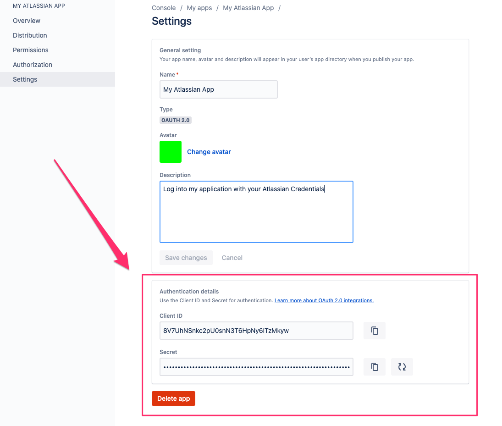

# keycloak-atlassian-identity-provider

Keycloak Identity Provider for Atlassian OAuth 2.0 (3LO) Applications

Atlassian Docs:

https://developer.atlassian.com/cloud/jira/platform/oauth-2-3lo-apps/#distributing-your-oauth-2-0--3lo--apps

## Build and Install

Download the source code and build the JAR file:

```bash
./mvnw clean package
```

Copy the built JAR, (ie: `target/keycloak-atlassian-plugin-1.0-SNAPSHOT.jar`)
into `$KEYCLOAK_HOME/providers` directory of your deploy.

## Setting up the Identity Provider in Keycloak

### Atlassian

Access the [Atlassian Developer Console](https://developer.atlassian.com/console) and create your application.


You can get Client ID and Client Secret from the created application.



### Keycloak

Add a new `atlassian` Identity Provider in the realm which you want to configure.


On the `atlassian` identity provider page, set `Client Id` and `Client Secret`
to the values from your App in the [Atlassian Developer Console](https://developer.atlassian.com/console).


Then copy the Redirect URI from Keycloak into your Atlassian Application
in the [Atlassian Developer Console](https://developer.atlassian.com/console).


## Installing in Keycloak <= 15.x (Docker example)

In Keycloak versions <= 15, we need to manually copy resource files from
`src/main/resources/theme-resources/resources/partials/` into
`/opt/jboss/keycloak/themes/base/admin/resources/partials/`. An example of 
this is included in the Dockerfile, `keycloak15.example.Dockerfile`.

Build with the example dockerFile:

```bash
docker build -t keycloak-atlassian-example -f keycloak15.example.Dockerfile .
```

Launch the container and log in with username `admin` and password `admin`: 

```bash
 docker run -it --rm -p 8080:8080 \
   -e KEYCLOAK_USER=admin \
   -e KEYCLOAK_PASSWORD=admin \
   keycloak-atlassian-example  
```

## Example - Keycloak > 15.x

```bash
docker build -t keycloak-atlassian-example -f keycloak20.example.Dockerfile .
```

Launch the container and log in with username `admin` and password `admin`:

```bash
 docker run -it --rm -p 8080:8080 \
   -e KEYCLOAK_ADMIN=admin \
   -e KEYCLOAK_ADMIN_PASSWORD=admin \
   keycloak-atlassian-example \
   start-dev
```


## License

[MIT License](https://opensource.org/licenses/MIT)


## Author

[ForAllSecure, Inc](https://forallsecure.com)
